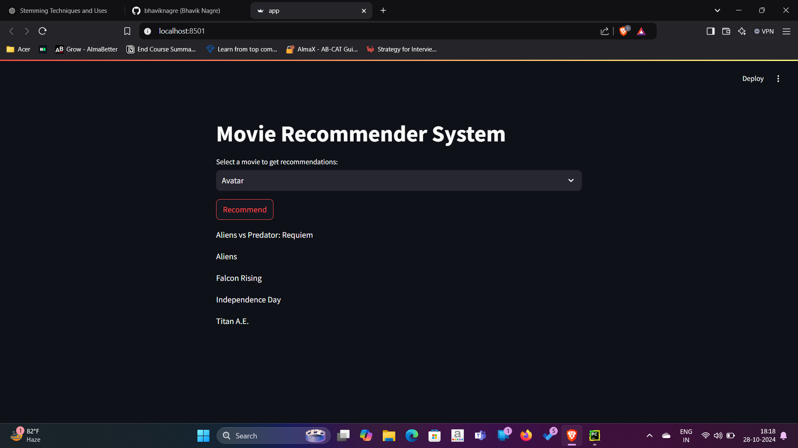
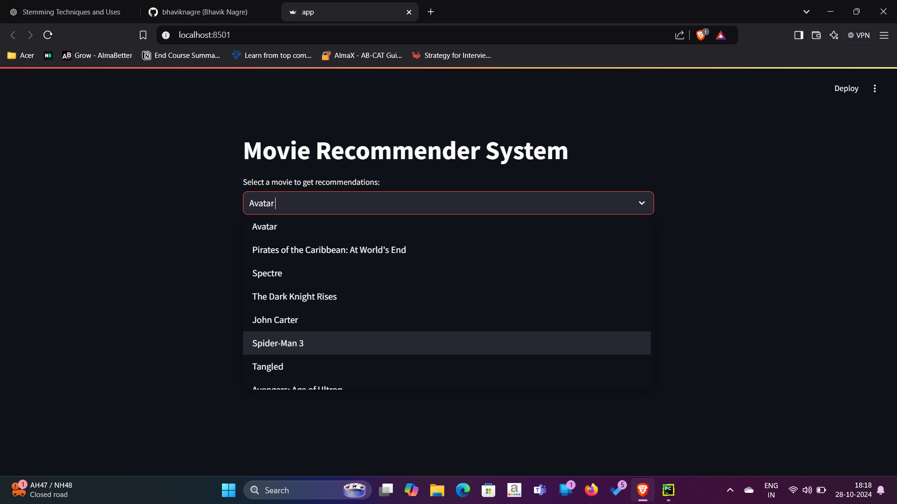
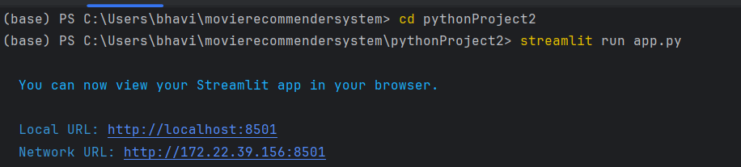

# Project Title

*Movie Recommendation System*

# Overview

*A movie recommendation system built using Streamlit and pre-trained similarity data. This system allows users to select a movie and receive recommendations for similar movies based on a similarity matrix.*

# Project Overview

This project is a content-based movie recommendation system that uses precomputed similarity scores between movies. It is implemented with:
 - Python for the backend,
 - Streamlit for the frontend, and
 - Gzip compression to store large .pkl files efficiently.

# Data Overview

- Data Source: Preprocessed movie dataset stored as movies.pkl.
- Key columns: title, genres, release_date, similarity_scores, etc.
- Dataset: Includes hundreds of popular movies, with similarity data used for recommendations.

# Recommendation Workflow

- Data Loading: Load compressed .pkl.gz files for movies and similarity matrix.
- Movie Similarity Calculation: Uses a similarity matrix to find the top 5 most similar movies for each selected movie.
- Streamlit Web Interface: Interactive UI for users to select movies and view recommendations.
- User Interaction: Simple select-box to choose a movie and view recommended options.

# Key Features

- Top Recommendations: Shows the five most similar movies based on selected input.
- Efficient Loading: Compressed .pkl files reduce memory load and optimize performance.
- Intuitive Interface: Streamlit provides an easy-to-navigate user interface.
- Customizable for Deployment: Readily deployable on platforms like Heroku or Streamlit Cloud.

# Technologies Used

- Languages: Python
- Libraries: Pandas, NumPy, Streamlit, gzip, pickle
- Machine Learning: Content-based filtering for movie similarity
- Tools: Jupyter Notebook, Streamlit, GitHub for version control

# Demo

Here’s a quick demonstration of the application:

*Screenshots:*

*YouTube Tutorial:*
https://www.youtube.com/watch?v=FahRc2BC3Tg

# Features

- Movie Recommendations: Get recommendations based on movie similarity.
- Efficient Data Loading: Uses compressed .pkl.gz files to handle large datasets.
- User-Friendly Interface: Built with Streamlit for ease of use.
- Fast and Lightweight: Ideal for local usage with precomputed data.

# Installation

1. Clone the Repository
Clone the repository to your local machine:
           git clone <your-repository-url>
           cd movie-recommender-system

2. Install Dependencies
Install the required Python packages:
           pip install -r requirements.txt

3. Data Files
Ensure the following compressed files are available in the root directory:

- similarity.pkl.gz: Compressed similarity matrix.
- movies (1).pkl.gz: Compressed dataset of movies

4. Run the Application
Run the application using Streamlit:
            streamlit run app.py

The application will be available on http://localhost:8501 by default.

# Usage

- Launch the Application: Open the app in a web browser using the provided URL.
- Select a Movie: Choose a movie from the dropdown list.
- Get Recommendations: Click on the 'Recommend' button to get a list of recommended movies similar to the selected one.

# File Descriptions

- app.py: The main Streamlit application script that loads the data, defines the recommendation function, and renders the user interface.
- similarity.pkl.gz: Contains a precomputed similarity matrix for movies, stored in a compressed format.
- movies (1).pkl.gz: Contains the movie dataset, including movie titles and other relevant information, stored in a compressed format.
- requirements.txt: Lists all the required Python packages for running the application.
- .gitattributes: Contains LFS configuration to handle large files like .pkl files for GitHub.
- images/: Directory containing screenshots of the application interface for demonstration purposes.

# Data Compression

To reduce storage and load time, the dataset and similarity matrix are stored in .pkl.gz compressed files. Below is the code used to compress these files:

import pickle
import gzip

with open('similarity.pkl', 'rb') as f_in:
    with gzip.open('similarity.pkl.gz', 'wb') as f_out:
        f_out.writelines(f_in)

# Compress movies (1).pkl
with open('movies (1).pkl', 'rb') as f_in:
    with gzip.open('movies (1).pkl.gz', 'wb') as f_out:
        f_out.writelines(f_in)
        
To load these compressed files in app.py:
with gzip.open('similarity.pkl.gz', 'rb') as f:
    similarity = pickle.load(f)

with gzip.open('movies (1).pkl.gz', 'rb') as f:
    movies_data = pickle.load(f)
    movies_list = movies_data['title'].values if 'title' in movies_data.columns else []

# Contributing

We welcome contributions! To contribute:

- Fork the repository and clone it locally.
- Create a new branch for your feature: git checkout -b feature-name.
- Commit your changes with clear messages: git commit -m "Add some feature".
- Push to the branch: git push origin feature-name.
- Create a Pull Request explaining your changes.

# Conclusion

This Movie Recommendation System provides a straightforward yet effective platform to suggest movies based on content similarity. Leveraging precomputed similarity data and an intuitive interface built with Streamlit, the system allows users to explore movies that match their interests quickly. The efficient handling of large datasets through compressed files ensures faster load times and minimal storage usage, making it ideal for local deployment. This project demonstrates how data compression and content-based filtering can enhance recommendation systems, providing a solid foundation for further improvements like collaborative filtering or hybrid models.

With potential expansions and enhancements, this project can evolve into a more robust recommendation system, catering to larger datasets and offering more personalized suggestions based on user history and preferences.

